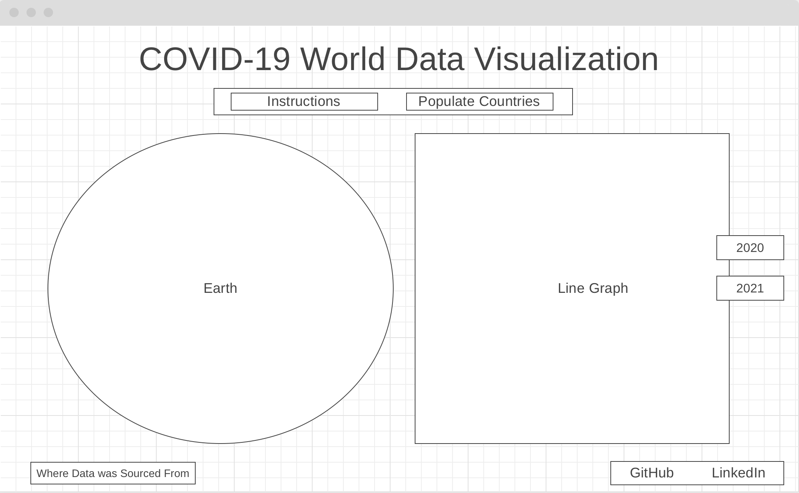

# COVID-19 World Data Visualization 

## Background

Live Site: [COVID-19 World Visualization Map](https://michelleahuang.github.io/Covid19-Visualization-Map/)

Since its emergence, COVID-19 has greatly impacted the state of the world. This interactive site aims to visualize the rise in COVID-19 cases in different countries around the world, starting from 2020, when the virus first started to spread, to the end of the year 2021. Click on a specific country on the globe to view its rise in cases over the last two years!

## Functionality & MVPs

In the COVID-19 World Data Visualization, users will be able to:
- Zoom in and out of the globe with their mouse to better click on and see the countries' dots 
- Interact with the globe with their mouse by dragging it to see another face of the Earth
- Select a country on the globe by clicking on its dot to see its COVID-19 line graph
- Hover over the country's dot and it will enlarge and change in color
- Hover over the country's dot and the country's name will show
- Toggle between the year 2020 and 2021 to see the country's data for each year

In addition, this project will include:
- A production README

 ## Wireframes

 

 - Nav links include links to this project's Github repo, my LinkedIn, and my AngelList
 - When page is first loaded, instead of a line graph showing, it will be the instructions page
 - When line graph is loaded, on the right, there will be clickable rectangles used to toggle between years
 - Below the title, there will be an Instructions button to reshow the instructions if needed and a button to populate the countries on the globe

## Technologies, Libraries, APIs

This project will be implemented with the following technologies:
- [Three.js](https://d3js.org/) to render the world globe
- [Chart.js](https://www.chartjs.org/) to render data visualization charts
- `Webpack` and `Babel` to bundle and transpile the source JavaScript code
- `npm` to manage project dependencies 
- Country COVID-19 data obtained through [JHU CSSE COVID-19 Data](https://github.com/CSSEGISandData/COVID-19)

## Implementation Timeline

- **Thursday Afternoon and Weekend**: Finish setting up project, including getting Webpack up and running. Create world globe and add its functionalities with countries. Import and clean/process data from COVID API. Create instructions box.
- **Monday**: Create line graph for each country for 2020. Create button for 2020 graph. 
- **Tuesday**: Create line graph for each country for 2021. Create button for 2021 graph. 
- **Wednesday**: Work on CSS styling.
- **Thursday**: Debug, continue working on styling, and add in nav links for LinkedIn and Github repo. Make site mobile friendly if there's time.

## Bonus Features
- Include a tooltip arrow for each country's label
- Have the graphs continue past 2021 into 2022 and continuously be updated 
- Include additional data, ie. number of recoveries and number of deaths per country
- Allow for data comparison between different countries
